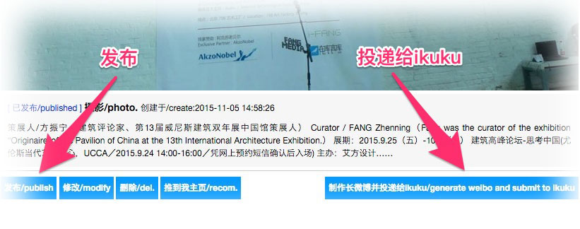

# 发布跟投递有什么区别？

答: 上传完成后点击 `"发布"`，作品会推送至用户中心主页，此时只有关注了该用户中心才能看到发布动态. 上传完成后点击 `"制作长微博并投递给ikuku"` ，是向ikuku投稿的过程，通过审核后ikuku会第一时间收录，此时作品有机会出现在`www.ikuku.cn` 首页，此时ikuku所有用户都可以看到发布动态。  

------
1. [发布跟投递有什么区别？](101-1.md)
1. [如何上传图片？](101-2.md)
1. [“参与人员”、“参与团队/企业”信息漏填,会有什么后果？](101-3.md)
1. [制作长微博图片跟投递有什么关系？](101-4.md) 
1. [如何做到图文穿插的效果?](101-5.md)
1. [投递之后还能修改吗?](101-6.md)

