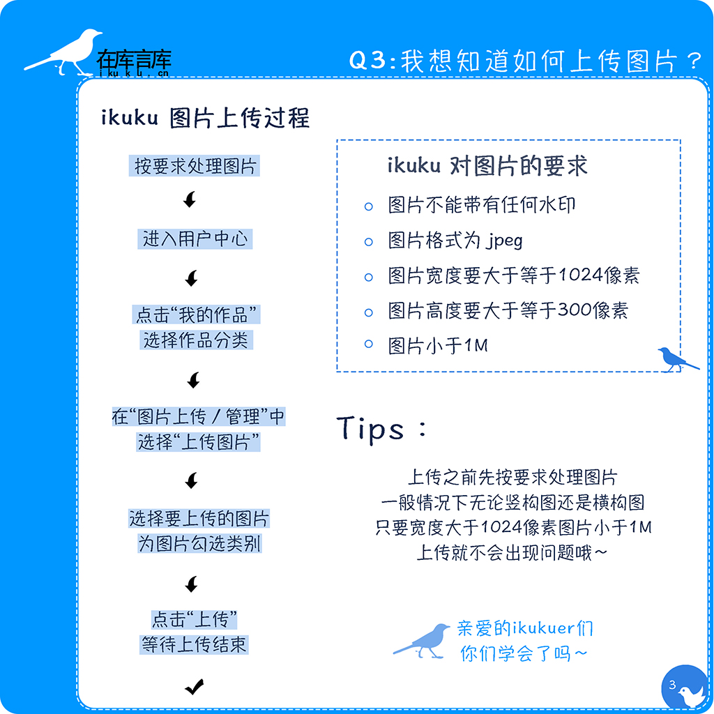

# 如何上传图片  
对于图片的要求不能一次掌握，上传总会出错?  

答: ikuku对图片的要求如下：

    a.图片不能带有任何水印；
    b.图片格式为jpeg；
    c.图片宽度要大于等于1024像素；
    d.图片高度要大于等于300像素；
    e.图片小于1M。
   
   (建议上传之前先按照要求处理图片，一般情况下无论是横构图还是竖构图，只要宽度大于1024像素，图片小于1M，上传不会出现问题。注意：此建议只适用于一般情况下的图片）
   
   ikuku图片上传过程：
   `按照要求处理图片→进入用户中心→点击“我的作品”→选择作品分类（项目、方案等）→点击“图片上传&管理→点击“上传图片”→点击“选择”→选择图片→选择图片“类别”→点击“上传”`

 
  <iframe height=330 width=510 src="http://player.youku.com/embed/XMTQ0OTUxNTYwOA==" frameborder=0 allowfullscreen></iframe>
  
------

1. [如何成为一个ikukuer？](101-0.md)
1. [发布跟投递有什么区别？](101-1.md)
1. [如何上传图片？](101-2.md)
1. [“参与人员”、“参与团队/企业”信息漏填,会有什么后果？](101-3.md)
1. [制作长微博图片跟投递有什么关系？](101-4.md) 
1. [如何做到图文穿插的效果?](101-5.md)
1. [投递之后还能修改吗?](101-6.md)

------

图片制作: [杨慧琳](http://www.ikuku.cn/name/9675) [马海东](http://www.ikuku.cn/user/1510)   
文字: [小门](http://www.ikuku.cn/user/xiaomen)  