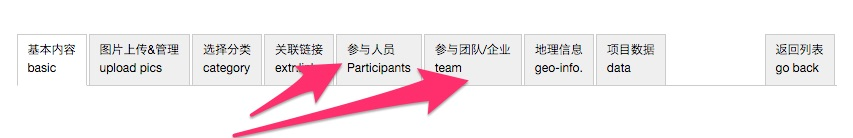

# “参与人员”、“参与团队/企业”信息漏填,会有什么后果？

答: “参与人员”、“参与团队/企业”信息填写是否完整，是ikuku审核的标准之一，非常重要。此外，ikuku的人物库和团队库信息与项目是相互关联的，信息填写完整也可以增加项目被搜索到的几率。

“参与人员”、“参与团队/企业”信息漏填会直接导致投稿审核不通过，作品被要求重新修改，直至符合ikuku发布要求。

------
1. [发布跟投递有什么区别？](101-1.md)
1. [如何上传图片？](101-2.md)
1. [“参与人员”、“参与团队/企业”信息漏填,会有什么后果？](101-3.md)
1. [制作长微博图片跟投递有什么关系？](101-4.md) 
1. [如何做到图文穿插的效果?](101-5.md)
1. [投递之后还能修改吗?](101-6.md)
