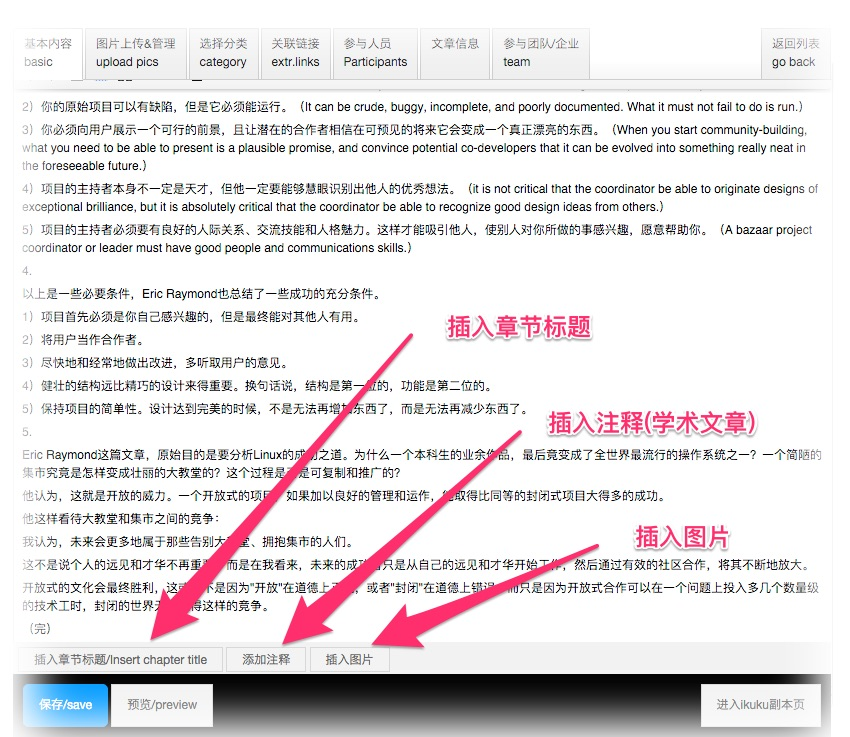
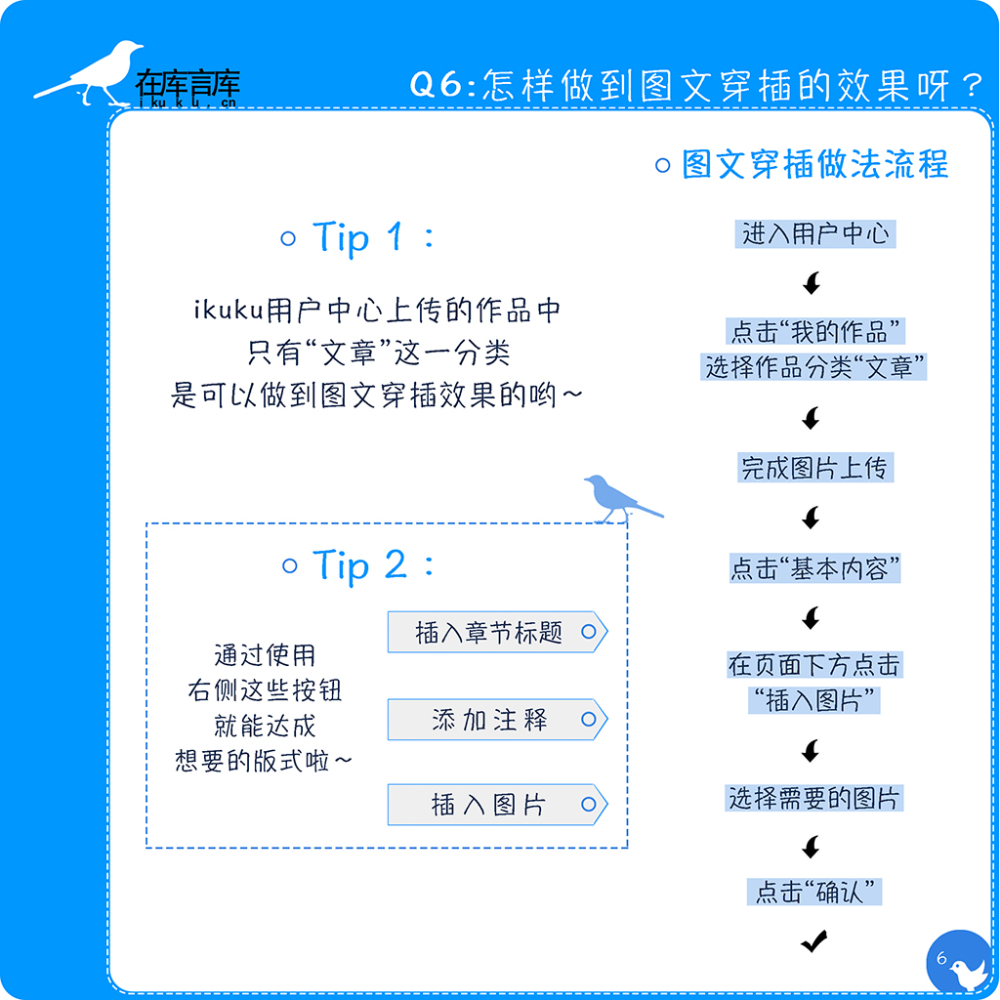

# 如何做到图文穿插的效果?

答: ikuku用户中心只有“文章”分类是可以做到图文穿插效果的。
   
过程如下：进入用户中心→点击“我的作品”→选择作品分类“文章”→完成图片上传→点击“基本内容”→在页面下方点击“插入图片”→选择图片→点击“确认”

（每行可以插入1-3张图片）

------
1. [发布跟投递有什么区别？](101-1.md)
1. [如何上传图片？](101-2.md)
1. [“参与人员”、“参与团队/企业”信息漏填,会有什么后果？](101-3.md)
1. [制作长微博图片跟投递有什么关系？](101-4.md) 
1. [如何做到图文穿插的效果?](101-5.md)
1. [投递之后还能修改吗?](101-6.md)

------

图片制作: [杨慧琳](http://www.ikuku.cn/name/9675) [马海东](http://www.ikuku.cn/user/1510)   
文字: [小门](http://www.ikuku.cn/user/xiaomen) 
