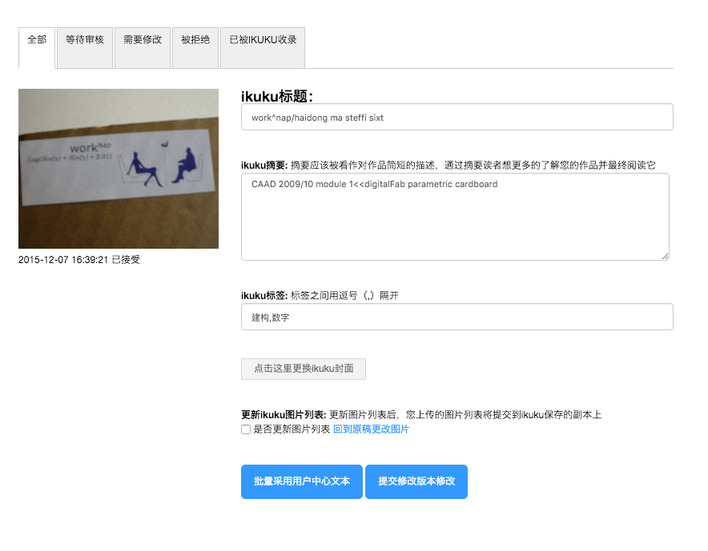
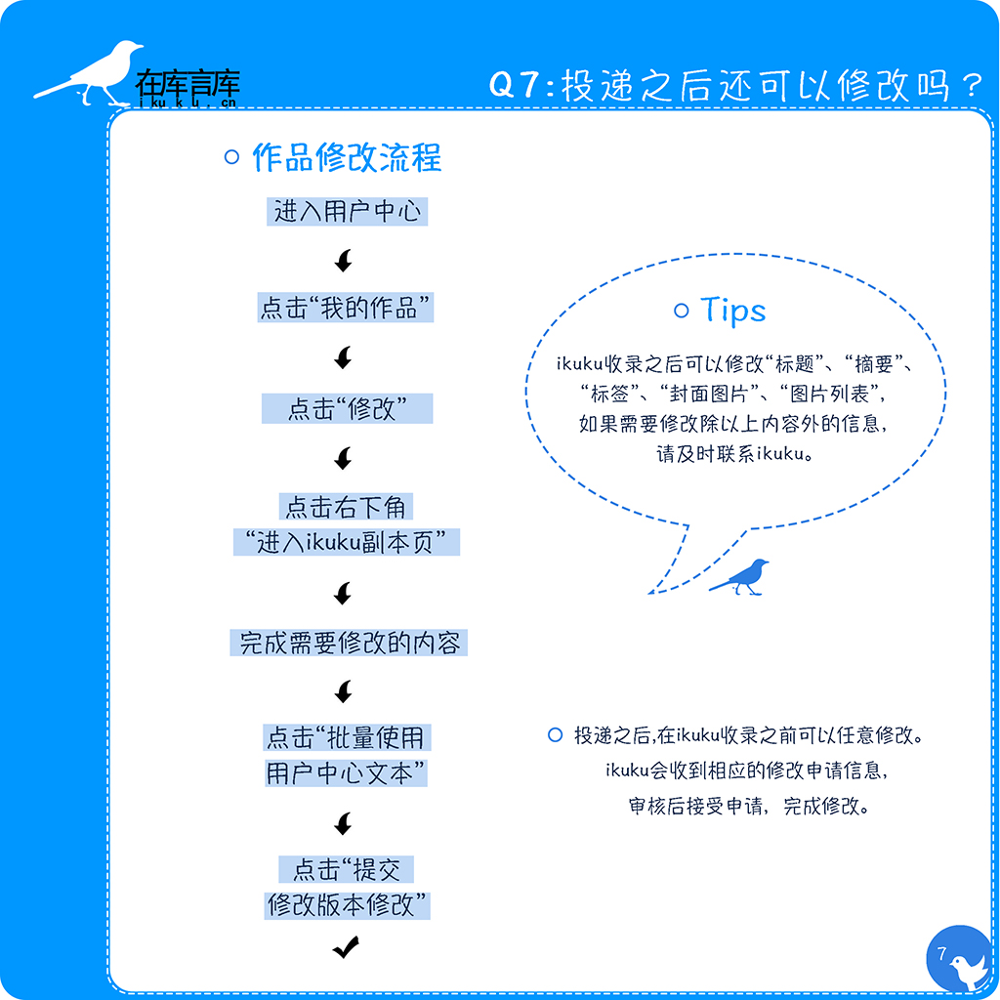

# 投递之后还能修改吗?

答: 投递之后，在ikuku收录之前可以任意修改。
   
ikuku收录之后可以修改“标题”、“摘要”、“标签”、“封面图片”、“图片列表”，如果需要修改除以上内容以外的信息，请及时联系ikuku。
   
修改过程如下：进入用户中心→点击“我的作品”→点击“修改”→点击右下角“进入ikuku副本页”→完成需要修改的内容（图片列表的修改需要提前完成）→点击“批量使用用户中心文本”→点击“提交修改版本修改”
   
ikuku会收到相应的修改申请信息，通过审核后会接受申请，完成修改。

------
1. [发布跟投递有什么区别？](101-1.md)
1. [如何上传图片？](101-2.md)
1. [“参与人员”、“参与团队/企业”信息漏填,会有什么后果？](101-3.md)
1. [制作长微博图片跟投递有什么关系？](101-4.md) 
1. [如何做到图文穿插的效果?](101-5.md)
1. [投递之后还能修改吗?](101-6.md)

------

图片制作: [杨慧琳](http://www.ikuku.cn/name/9675) [马海东](http://www.ikuku.cn/user/1510)   
文字: [小门](http://www.ikuku.cn/user/xiaomen) 