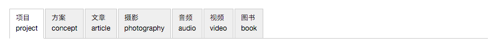

# 建筑师ikuku入门手册

通过[用户中心->我的作品](http://www.ikuku.cn/ucenter.php?action=works-list)，您可以向ikuku.cn|在库言库投递项目、文章、摄影作品、视频、音频及图书等作品。

上传之后点击`发布/publish`就可显示在你的个人主页上。  
点击`制作长微博并投递给ikuku/generate weibo and submit to ikuku`则可以投稿到ikuku，并有机会在ikuku首页上展示。

以下是你在上传过程中可能碰到的问题及如何解决:

1. [发布跟投递有什么区别？](101-1.md)
1. [如何上传图片？](101-2.md)
1. [“参与人员”、“参与团队/企业”信息漏填,会有什么后果？](101-3.md)
1. [制作长微博图片跟投递有什么关系？](101-4.md) 
1. [如何做到图文穿插的效果?](101-5.md)
1. [投递之后还能修改吗?](101-6.md)
 

   
 

