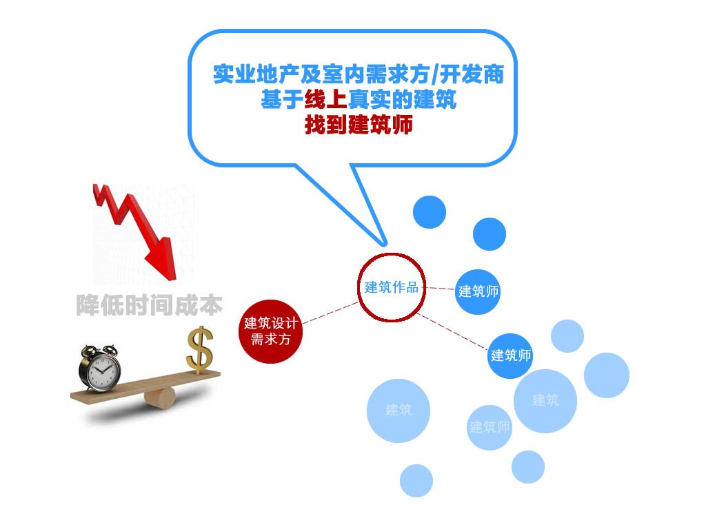
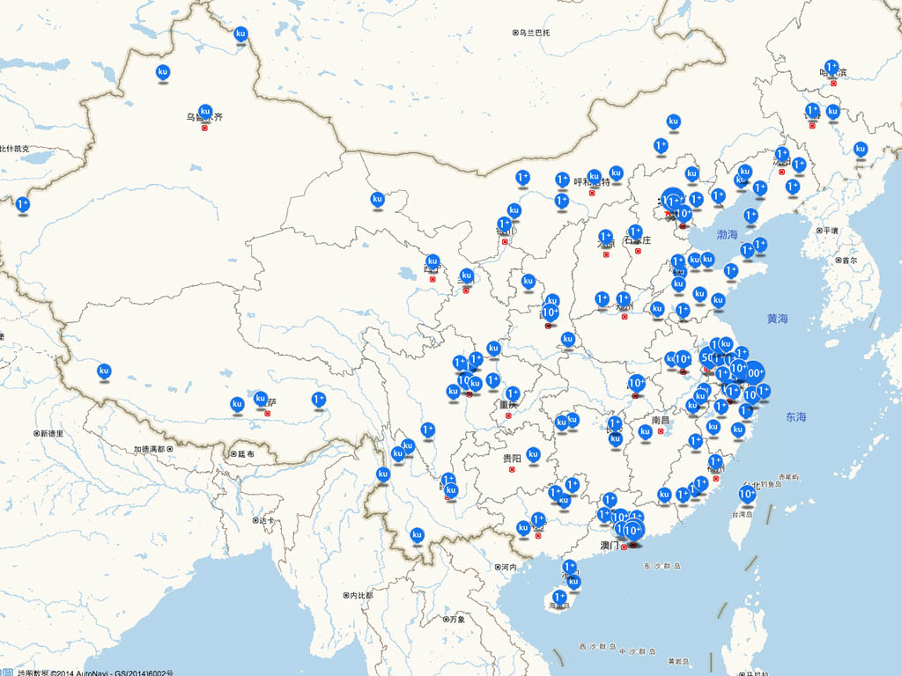

# ikuku.cn|在库言库使用手册 
版本号: v0.01   

-----

1. [你为什么要入驻ikuku?](signup.md)  
1. [ikuku入门手册(玩转ikuku的6个小窍门)](101.md)  
1. [ikuku社区服务手册](ucenter.md)  
1. [ikuku电商](shop.md)  
1. [微信服务号手册](weixin.md)
1. [如何玩转ikuku微信订阅号](weixinsubscribe.md)
1. [绑定第三方账号](bind.md) 
1. [ikuku会员有哪些服务？](member.md)
1. [如何加入ikuku.cn|在库言库团队?](volunteer.md)  
1. [Q&A](qa.md)

-----

ikuku.cn|在库言库（www.ikuku.cn）是中国第一个建筑设计行业的自媒体社区(UGC)及项目轻量级托管平台，聚集了百年全谱的全球华人优秀建筑设计师（包括90%以上大陆地区顶级建筑师），ikuku致力与解决线下建筑设计及室内装修市场交易及控制风险成本及高的问题,通过ikuku.cn的大数据及垂直优化算法，需求方可以找到高匹配度的建筑师、摄影师、专家学者等，从而降低交易时间成本，提高项目完成度。

目前ikuku上实名建筑师超过7,000人，用户超过30,000人，并以第三方担保的模式完成多个建筑及装修项目及承办过大型全国建筑设计大赛（40多个国家参与）。

-----

### p1 ikuku.cn|在库言库: 互联网+建筑设计

* ikuku的使命: 让更多的人通过建筑设计改善工作与生活环境   

---

### p2 市场痛点  

* 行业: 传统建筑设计及室内装修市场。  
* 现状: 供需双方信息不透明,不对等。   
* 痛点: 供需双方存在着匹配度极差及交易风险成本极高的问题。    

---

### p3 解决方案

* 提高透明度: 为设计服务方提供一个真实的、面向大众的建筑设计自媒体社区(UGC) ,同时为需求方的项目提供一个轻量级的托管平台。
* 提高匹配度: 通过用户生成的结构化大数据(UGC)以及相关性优化算法,设计供需双方可以进行精准的匹配。   
* 增加信任度: 通过ikuku平台第三方担保模式，设计供需双方可以完成相关交易及相关服务。

---

### p4 运营情况  

**ikuku.cn|在库言库发展历史**

* 2012.1.1 ikuku.cn|在库言库成立    

**核心业务:建筑设计自媒体社区**   

* ikuku.cn为建筑作品提供丰富的媒体展示工具及互联网传播服务。
* ikuku.cn已经成为全国最真实的最大的建筑师作品发布平台(全国90%以上一线城市一流建筑师已经入驻)。 

**核心业务:项目轻量级托管平台**  

* ikkuku已成功推介并装修完成了极客咖啡、新客多连锁理发店等多个装修项目，获得需求方的好评口碑并制作了流程视频进行互联网传播。 
* 通过ikuku上已有的大量数据, ikuku已经成功的向设计需求方提供专家级的咨询及设计监理服务。

**增值业务:试运营中的建筑设计垂直社区买手淘宝店**  

* 向设计服务方提供设计工具及耗材。
* 向设计服务方提供专业培训服务。 

---

### p5 用户&客户 

* 设计需求方:地产开发、室内装修等    
   * 发布精准的设计需求      
   * 寻找匹配的建筑师   
* 设计服务方: 建筑师及团队、建筑设计评论人、策展人等  
   * 通过ikuku发布作品并进行互联网传播  
   * 浏览ikuku上的作品获得灵感及启发  
   * 查阅建筑材料及产品 
   * 购买设计相关的工具及耗材、参加专业的培训教程   
* 建筑材料及产品品牌商   
   * 在建筑作品中展现建筑产品的品牌  
   * 向线上目标用户投放精准的广告及举办线下产品推介活动  

---

### p6 收入模式 

免费+增值服务

---

### p7 管理团队 

**马海东(创始人) **  

* 梦想: 建筑互联网化、数字化  
* 从业经历
  *  2011 北京市建筑设计研究院院BIM(建筑信息模型化)研究所总工  
* 教育情况  
  * 2009-2010 苏黎世瑞士理工大学(全球最好的建筑设计数字化互联网化专业) 计算机辅助建筑设计 编程    
  * 2000-2003 清华大学 建筑学硕士 

**刘非(联合创始人) **  

* 从业经历  
  * 2003-2008 北京市建筑设计研究院(全国最好的建筑设计研究院)  建筑师  
* 教育情况  
  * 2009-2010 伦敦大学学院(Times 2013全全球排名第7)， 建筑学院The Barlett, 项目与企业管理  

----

 
### p8 里程碑  

* 真实作品: 8000+
* 真实人物: 7500+ 
* 用户总量: 40,000+  
* 组织过全球性建筑设计竞赛(40多个国家参加) 

### p9 相关媒体报道
    
* 搜狐:   
[越来越多的甲方在 ikuku.cn 上找建筑师，会是一种建筑设计 O2O 的方向吗？](http://mt.sohu.com/20150423/n411741902.shtml)
* tech2ipo:  
[ikuku：建筑界的「约拍」](http://tech2ipo.com/89537)
* archdaily:  
[Open Call: GARS-NEPAL.TIBET Earthquake Emergency Reconstruction Competition](http://www.archdaily.com/640481/open-call-gars-nepal-tibet-earthquake-emergency-reconstruction-competition)
* 爱奇艺:  
[起风了入驻项目之ikuku](http://www.iqiyi.com/w_19rtke3hpp.html)

