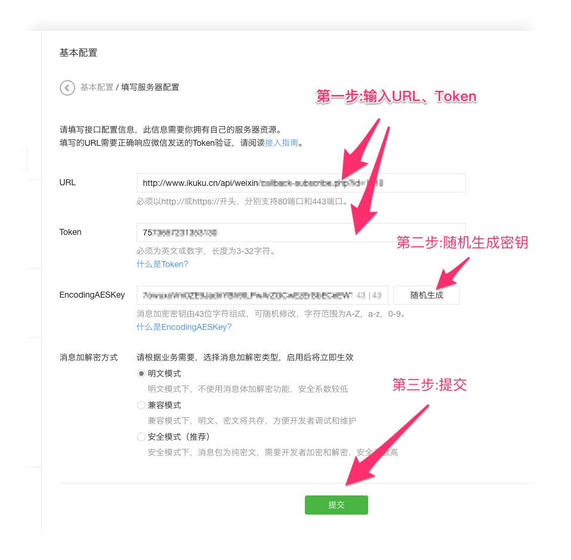

# 绑定第三方账号

### 绑定微信公众号

**设置搜索功能**
* 简介: 通过设置搜索功能，你的公众号粉丝可以通过输入框获取你(不包括其他人的)上传到ikuku的作品。  
* 设置方法: 进入 `微信公众平台->开发->基本配置->服务器配置` 之后填写“URL”、“token” 并让机器随机生成 “EncodingAESKey” ,然后提交。
  即可开启搜索功能，用户可以通过输入获取你在ikuku上的作品。 
  
  

   

**自定义菜单**
* 简介: 经过微信官方认证的公众号可以设置自定义菜单。
* 微信官方声明:暂不支持个人类型的公众帐号申请微信认证,因此个人公众号没法定制菜单。  
* 设置方法见微信官方的介绍: https://mp.weixin.qq.com/wiki?t=resource/res_main&id=mp1421141013  
