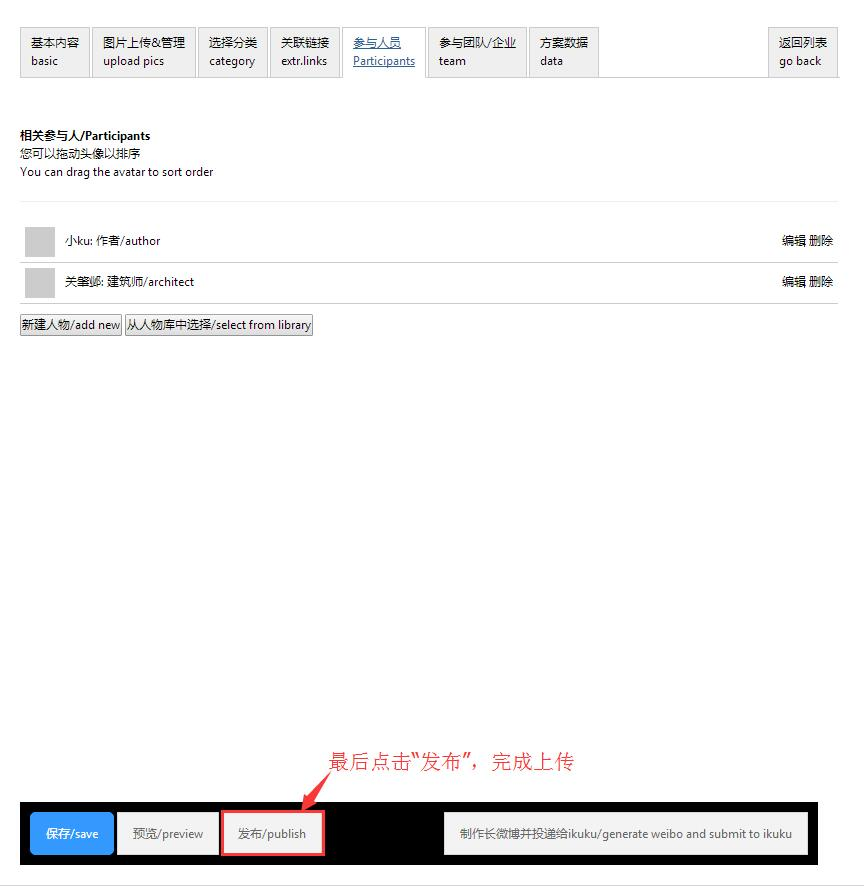

# 竞赛作品上传教程：文章

### 步骤1 注册ikuku账号及登陆 http://www.ikuku.cn/userlogin.php 
* 1.1 已有ikuku账号直接登录，如没有，需在左侧先注册即可登录。  

### 步骤2 报名竞赛 http://www.ikuku.cn/ucenter.php?action=o2o 
* 2.1 进入ikuku页面后，**点击右上角的个人用户下拉按钮**，点击“竞赛或委托”进入报名、上传作品页面。  
  
* 2.2 在“评选竞赛”中选择要参与的竞赛（以“识古寻踪竞赛”为例），**点击蓝字立即报名**，如竞赛需要购买会附上链接，报名后即可点击购买链接。
  
* 2.3 报名成功后即获得本次竞赛的**参赛编号**，**点击“更新/update”可以上传或更新作品文章**。  
  
  
### 步骤3 上传及更新参赛文章 http://www.ikuku.cn/ucenter.php?action=works-list&type=article
* 3.1 进入上传或更新文章页面，**从“基本内容”向右依次填写文章信息**，“基本内容”中**标签一栏需填写本次竞赛名称**，上传文章中注意多次保存。
  
*    正文编辑时可以**点击“插入章节标题”让文章层级分明**，可读性更强。
 
*    正文编辑时可以**点击“添加注释”为文章标注参考文献出处**，更具专业性。
 
* 3.2 在“图片上传&管理”中**点击“上传图片”为文章添加照片**（注意：图片只能提交**JPG格式,宽度不得小于1024像素，高度不得小于300， 文件大小不超过1MB**）。
 
*    按照**“选择图片——选择照片类型——点击‘上传/upload’”进行图片上传**，注意保存。
 
*    上传多张图片后可以点击“设置成封面”选择封面图片，注意保存。
 
* 3.3 返回“基本内容”，在文章正文编辑中**“插入图片”即可在指定位置插入**。
 
* 3.4 进入“参与人员”页面**点击“新建人物”即可创建参与人员信息**，注意保存。
 
*    按照**“添加作者姓名—勾选作者角色——填写个人联系邮箱——提交“**添加至少一位人员信息,如有多名参赛者可用填写多名。
 
* 3.5 最后**点击“发布”完成文章上传**。
 
