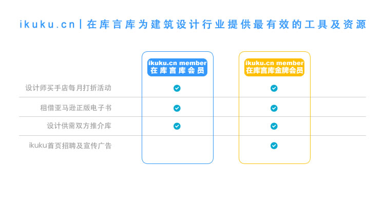

# ikuku.cn|在库言库会员服务

ikuku.cn自2012年上线以来，我们一直坚持公益性及免费的原则，也得到了广大的建筑设计行业朋友的支持及反馈。在未来我们承诺我们已有公益性、免费媒体功能会一直保持并不断加强，因为这是ikuku可以持续发展的基石。只有这样ikuku的服务才有可能快速的迭代从而赢得用户的信任。  

同时经过这3年的运营及迭代，我们拥有了大量的有有价值的上下游的资源。 因此我们推出了`ikuku会员`及`ikuku金牌会员`的的增值服务,其目的是期望为有更强需求的个人及企业提供更有价值的服务。 

**问：**如何成为会员？   
**答:**点击[ikuku淘宝店](https://shop130496019.taobao.com)的链接: https://shop130496019.taobao.com 

**问：**如何收费？  
**答：**按年收费，ikuku会员价格为99元人民币， ikuku金牌会员价格为999元人民币。  

### 服务介绍  

**1. 设计师买手店每月打折活动阅(即将上线)**   
* 通过与下游商家的资源合作，ikuku每月会为会员举办合作商家设计类产品线上优惠打折活动。 目前合作的商家有: [加意新品](http://www.jiae.com)，其CEO为百度前任体验总监郭宇。  

**2. kindle图书借阅(即将上线)**   
基于ikuku上面有大量的建筑设计爱好者这一现状，ikuku将建立建筑设计外文电子图书馆，之后会员们可以通过ikuku进行借阅。  
* ikuku.cn会在[亚马逊kindle store](http://www.amazon.com/Kindle-eBooks)购买正版建筑设计类电子书。  
* ikuku会员可以在ikuku.cn及ikuku微信服务号上借阅ikuku的正版kindle图书，借阅期为14天，之后电子书会被自动收回。  
* 详细介绍见:  http://www.amazon.com/gp/help/customer/display.html?nodeId=200549320  

<h4>Video: Lend or Borrow Kindle Books</h4>

<iframe height="288" id="viddler-823e0a0a" mozallowfullscreen="true" src="//www.viddler.com/embed/823e0a0a/?f=1&amp;autoplay=0&amp;player=full&amp;secret=103366756&amp;loop=0&amp;nologo=0&amp;hd=0&amp;scAccountName=acsus-prod" webkitallowfullscreen="true" width="300"> </iframe>   

**3. 设计供需双方推介库阅(即将上线)**      
* ikuku为会员专门建立建筑设计供需双方的推介库(多个ikuku微信群)。
* 会员可以向ikuku提出各方面的需求，ikuku会在原有免费渠道的基础上向会员发布合适的需求，并提供更多推介的机会。  

  
   
**4. ikuku首页招聘及宣传广告**    
ikuku的首页广告位将为金牌会员提供免费的展示机会。  

建议将“招聘”和“广告”服务拆分开，“广告”除需另外提交banner图片外，其他流程与招聘基本一样，但对于用会来说是两个服务。
