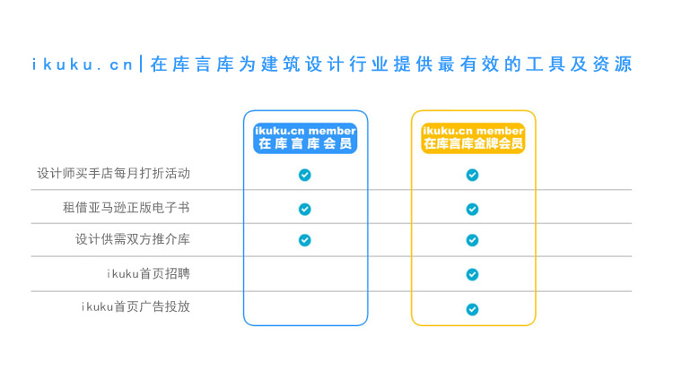
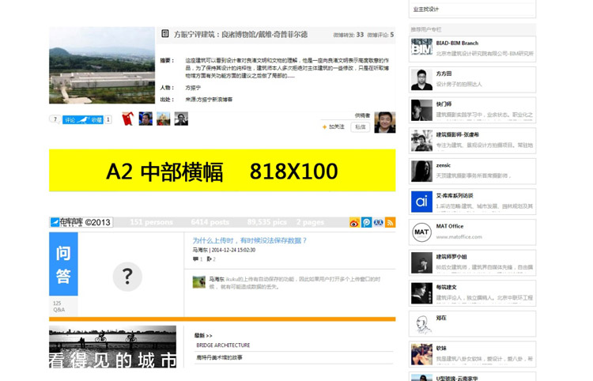

# ikuku.cn|在库言库会员服务

ikuku.cn自2012年上线以来，我们一直坚持公益性及免费的原则，也得到了广大的建筑设计行业朋友的支持及反馈。在未来我们承诺我们已有公益性、免费媒体功能会一直保持并不断加强，因为这是ikuku可以持续发展的基石。只有这样ikuku的服务才有可能快速的迭代从而赢得用户的信任。  

同时经过这3年的运营及迭代，我们拥有了大量的有有价值的上下游的资源。 因此我们推出了`ikuku会员`及`ikuku金牌会员`的的增值服务,其目的是期望为有更强需求的个人及企业提供更有价值的服务。 

**问：会员有哪些服务？**
**答：**

1.设计师买手店每月打折活动日
在每月最后一个星期四（如遇法定节假日顺延一周），在设计师买手店里的所有商品，会员可以以接近ikuku进货成本价购买到所需商品，每月更新。折扣日商品价格请参考：[ikuku摆地摊-会员专区](http://www.ikuku.cn/ucenter.php?action=shop) 。
2.借阅亚马逊正版电子书
会员可以在ikuku.cn及ikuku微信服务号上免费借阅ikuku的正版kindle图书，借阅期为14天，书目请参考：[ikuku摆地摊-电子图书](http://www.ikuku.cn/ucenter.php?action=shop&type=kindle) 。
3.设计供需双方推介库
为会员专门建立建筑设计甲、乙双方的推介库(多个ikuku微信群)。
4.ikuku首页招聘宣传
为金牌会员免费提供ikuku.cn首页右侧栏招聘宣传。
5.ikuku广告投放
为金牌会员免费提供ikuku.cn首页图文广告。
**ps.**详情见下文

**问：会员如何参与设计师买手店每月会员打折日活动？**
**答：**
1.成为ikuku会员或者ikuku金牌会员
2.每月的会员打折日当天，点击[ikuku摆地摊-会员专区](http://www.ikuku.cn/ucenter.php?action=shop)查看折扣价格。
3.到ikuku电商按照原价购买商品。
4.通过电商平台将你在ikuku上的ID告诉ikuku，核实会员身份后，ikuku会将商品差价退还。

**问：会员如何免费借阅亚马逊正版电子书**
**答：**通过ikuku.cn 将你在ikuku上的ID及想要借阅的电子书告诉[admin](http://www.ikuku.cn/user/1)

**问：如何成为会员？**
**答：**点击[ikuku淘宝店](https://shop130496019.taobao.com) 或者点击[ikuku微信微店](http://mp.weixin.qq.com/bizmall/mallshelf?t=mall/list&biz=MjM5OTAxMDE2MA==&shelf_id=1&showwxpaytitle=1&scene=1&pass_ticket=eNVNbJGCmTjtOURVx3E3w7qJlgI6SpwfA1jiC4nxW2EIS3ikD2eJ9XjZhI%2BSzt8a)，完成支付后，通过电商平台将你在ikuku上的ID告诉ikuku，以便我们存档。

**问：如何收费？**  
**答：**按年收费，ikuku会员价格为99元人民币， ikuku金牌会员价格为999元人民币。  

**问：如何查询你在ikuku上的ID**
**答：**参见：http://www.ikuku.cn/post/97400

____________________________________________________________________

### 服务介绍  

**1. 设计师买手店每月打折活动日**   
通过与下游商家的资源合作，ikuku每月会为会员举办合作商家设计类产品线上优惠打折活动。目前合作的商家有: [加意新品](http://www.jiae.com)，其CEO为百度前任体验总监郭宇。ikuku会持续不断的为会员挑选、开发物美价廉的设计类产品，包括文具、箱包、时尚用品、日用品等。

在每月最后一个星期四（如遇法定节假日顺延一周），在设计师买手店里的所有产品，会员可以以接近ikuku进货成本价购买到所需产品，仅此一天。

同时，如果会员对某些其他设计类产品有需求，可以告诉ikuku，我们将为您积极寻优惠的渠道，把高性价比的产品带给您！

**2. kindle图书借阅**   
基于ikuku上面有大量的建筑设计爱好者这一现状，ikuku将建立建筑设计外文电子图书馆，之后会员们可以通过ikuku进行借阅。  
* ikuku.cn会在[亚马逊kindle store](http://www.amazon.com/Kindle-eBooks)购买正版建筑设计类电子书。  
* ikuku会员可以在ikuku.cn及ikuku微信服务号上借阅ikuku的正版kindle图书，借阅期为14天，之后电子书会被自动收回。  
* 详细介绍见:  http://www.amazon.com/gp/help/customer/display.html?nodeId=200549320  

<h4>Video: Lend or Borrow Kindle Books</h4>

<iframe height="288" id="viddler-823e0a0a" mozallowfullscreen="true" src="//www.viddler.com/embed/823e0a0a/?f=1&amp;autoplay=0&amp;player=full&amp;secret=103366756&amp;loop=0&amp;nologo=0&amp;hd=0&amp;scAccountName=acsus-prod" webkitallowfullscreen="true" width="300"> </iframe>   

**3. 设计供需双方推介库(即将上线)**      
* ikuku为会员专门建立建筑设计供需双方的推介库(多个ikuku微信群)。
* 会员可以向ikuku提出各方面的需求，ikuku会在原有免费渠道的基础上向会员发布合适的需求，并提供更多推介的机会。  

  
   
**4. ikuku首页招聘**    
ikuku的首页广告位将为金牌会员提供免费的展示机会。  

服务：招聘文章会在 www.ikuku.cn 首页右侧广告位持续出现。
　　　招聘文章会在 www.ikuku.cn 官方网站、ikuku微信服务号、ikuku微信订阅号、@ikuku建筑网 微博绑定宣传一次。

要求：在ikuku.cn上传包含至少1张图片的招聘文章一篇（建议图片包含室内室外，充分体现工作环境）

**5. ikuku广告投放**   
www.ikuku.cn 拥有5万注册用户，10.2分钟/人平均访问时长，7页/人平均访问页数，用户主要由一线成熟建筑师、评论人、学生和业主构成。

我们将在ikuku.cn首页A2位置（如下图），为您提供为期2周的轮播广告。需向我们提供818*100像素的广告横幅，点击后可链接到您在ikuku上的主页。

