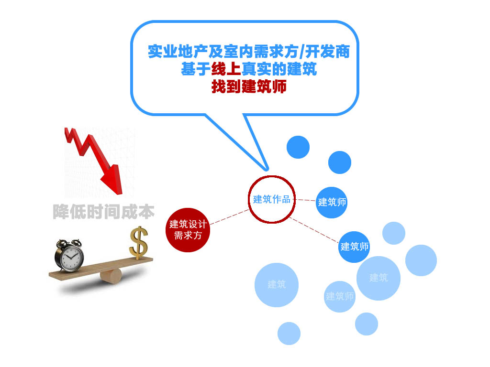

# 需求方在ikuku上能得到哪些服务？

服务范围: 任务书制作、建筑设计、室内设计等...

1. [委托设计或者设计竞赛](http://www.ikuku.cn/o2o.php)  
1. [专家咨询服务](http://wenda.ikuku.cn/index.php?qa=ask&cat=7) 
1. [做一个靠谱的甲方需要哪些知识储备？](http://www.ikuku.cn/tag/%E7%94%B2%E6%96%B9%E6%95%85%E4%BA%8B)

-----

### 设计需求方的痛点
在一个几乎100%线下的建筑设计及室内装修市场中交易及控制风险成本极高。  

### ikuku的解决方案
通过ikuku.cn的大数据及相关性算法，需求方可以找到高匹配度的建筑师及相关产品，从而降低交易时间成本，提高项目设计的完成度。

----
 

### Q&A
**问**：为什么ikuku可以撮合建筑设计的供需双方？    
**答**：ikuku.cn|在库言库是中国第一个建筑创意行业的自媒体平台（UGC），平台聚集了百年全谱的全球华人优秀建筑设计师.

**问**：为什么选择ikuku作为第三方？    
**答**：以ikuku品牌作为背书，通过建立甲乙双方的信用机制简化商务流程。通过特色的ikuku建筑师总负责制在合理的成本范围内，协助需求方及建筑师提高项目的完成度。

----

### 已有客户
极客咖啡、天使汇、星客多、一鸣真鲜奶吧、北京市规划委员会

