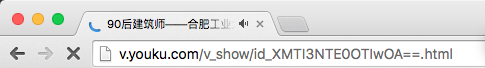
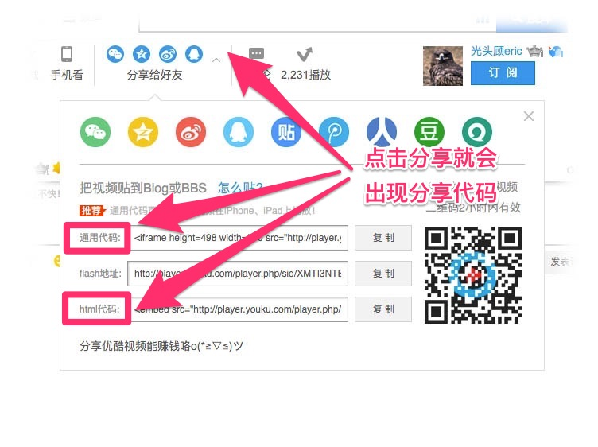

# 如何填写视频音频代码?

### 手机视频代码  
1. 将您的视频上传到各大视频门户网站(如土豆，优酷)，上传后拷贝视频的链接地址到链接地址输入框。

2. 在本视频网站上找到分享**通用代码**（可以让你的视频在iPhone、iPad上播放！）拷贝并复制到输入框。 
 
### 桌面视频代码   
1. 在本视频网站上找到分享**html代码**（可以让你的视频在电脑的浏览器中播放！）拷贝并复制到输入框。 

-----

