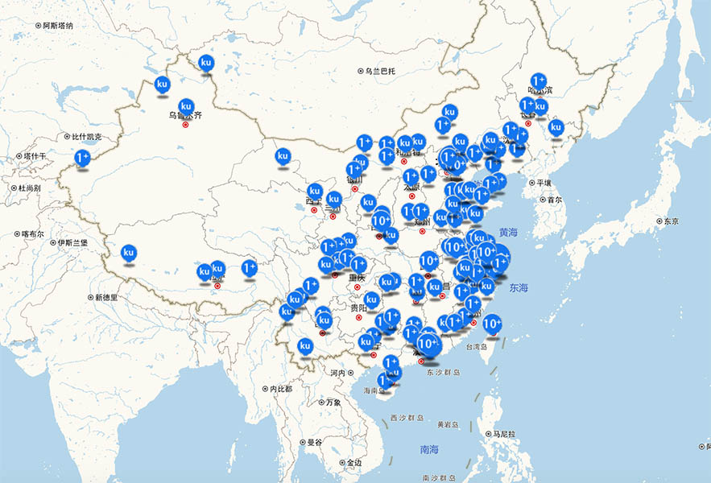

# 建筑师为什么要入驻ikuku?

**ikuku.cn︱在库言库 是谁?**  
ikuku.cn|在库言库（www.ikuku.cn）是中国第一个建筑设计行业的自媒体社区(UGC)及项目轻量级托管平台。详情点击[简介](http://guide.ikuku.cn/index.html)  

**ikuku.cn︱在库言库 在做什么？**  
建立以公益为目的的，中立观点的，线上开放聚合的百年华人建筑库。  

**ikuku.cn︱在库言库 的立场？**  
ikuku自己不生成内容，所有内容及项目均来自设计团队和网络。ikuku在这过程中持中立态度，不对所展示的信息发表主观评论。
对于不实信息，ikuku的处理原则是：  
a. 与当事人核实  
b. 出现遗漏及时更正  
c. 对于恶意评论及人身攻击进行屏蔽  
d. 如出现有争议的话题ikuku将遵从法律及版权所有者的意见进行修改或删除  

**ikuku.cn |在库言库 为建筑师提供什么？**  
1.作品展示  
在www.ikuku.cn 上传你的作品展示给用户，并有机会在官方微博、微信发布。  
2.媒体支持  
推介您组织或参与的活动  
3.招聘  
工作招聘推广，找到理想的工作伙伴  
4.获取资讯  
海量项目、文章、照片、工程图纸  
5.订阅  
半月刊/一月刊，Rss阅读器，在个人中心用采风集收藏您感兴趣的post  
6.O2O 供需双方撮合  
通过ikuku.cn的大数据及垂直优化算法，业主在数据库中可以高匹配度的找到建筑师、摄影师、学者等，从而降低交易时间成本，提高项目完成度。  
ikuku作为第三方，以ikuku品牌作为背书，通过建立甲乙双方的信用机制简化商务流程。通过特色的[ikuku建筑师总负责制](https://gitcafe.com/ikuku/hub.caad.xyz/blob/master/studio.md)在合理的成本范围内，协助需求方及建筑师提高项目的完成度。  

**ikuku.cn |在库言库 收录过什么？**  
专辑：170+
人物：7000+
项目：4000+
注册用户：40000+
文章：1600+
图片：100000+
团队：3000+
活动：180+
视频、音频：70+
专栏：50+
招聘：30+
  

**ikuku.cn |在库言库 做过哪些专辑？**  

**ikuku.cn |在库言库 合作机构有哪些？**  
《建筑师》杂志 、《建筑学报》杂志、《世界建筑》杂志、《建筑创作》杂志、《El Croquis中文版》杂志、《建筑技艺》杂志、思班机构、方媒体等  

**如何入驻ikuku？**  
上传作品即为入驻ikuku，点击[上传作品](http://www.ikuku.cn/self-media/upload/upload-note.php)开始上传。首次上传请参考[建筑师ikuku入门手册](101.md)。  

