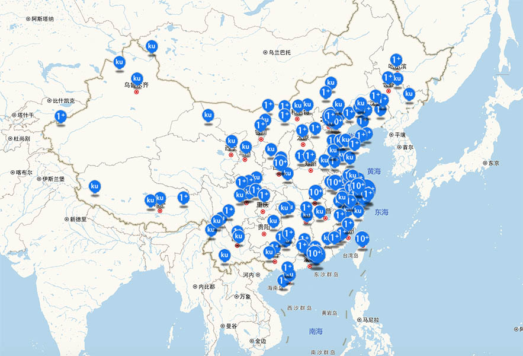

# 建筑产品及品牌入驻

ikuku.cn|在库言库（www.ikuku.cn）是中国第一个建筑设计行业的自媒体社区(UGC)及项目轻量级托管平台，聚集了百年全谱的全球华人优秀建筑设计师（包括90%以上大陆地区顶级建筑师），ikuku致力与解决线下建筑设计及室内装修市场交易及控制风险成本及高的问题,通过ikuku.cn的大数据及垂直优化算法，需求方可以找到高匹配度的建筑师、摄影师、专家学者等，从而降低交易时间成本，提高项目完成度。  
目前ikuku上实名建筑师超过7,000人，用户超过30,000人，并以第三方担保的模式完成多个建筑及装修项目及承办过大型全国建筑设计大赛（40多个国家参与）。

----

**ikuku.cn︱在库言库 是找到建筑师最便捷的途径**  
注册用户：40000+  
订阅用户：30000+  
微博用户：80000+  
微信用户：20000+  
收录项目：4000+  
收录人物：7000+  

----

**ikuku.cn︱在库言库 用户浏览习惯**  
平均访问时长:10.2分钟/人  
平均访问页数:6.97页/人  
跳出率：42.1%  

----

**建筑师提交项目区域分布**     
  

----

**ikuku.cn︱在库言库 合作机构**  
* 《建筑师》  
* 《建筑学报》  
* 《世界建筑》  
* 《建筑创作》   
* 《El Croquis中文版》   
* 《建筑技艺》  
* 思班机构    
* 方媒体   
* ...

----

**为建筑产品及品商提供的服务**  
1. 建立产品库（免费）  
将品牌、材料、设备以及公司介绍以文字、照片、视频形式便捷的展现到建筑师和业主面前，让更多的专业人士了解你的品牌和产品。  
点击[上传作品](http://www.ikuku.cn/self-media/upload/upload-note.php)开始上传。首次上传请参考[ikuku上传入门手册](101.md)。 
2. ikuku建筑师专家库推介（收费）  
将你的产品链接到你参与过的项目中，方便建筑师、业主参考并更容易获得用户信赖。  
经ikuku专家建筑师认可的品牌、产品将出现在推荐页面。  
3. 广告横幅（收费）

 ------
 
 1. [建筑设计师:ikuku能为你提供什么?](signup-1.md) 
   * 通过ikuku发布作品并进行互联网传播
   * 浏览ikuku上的作品获得灵感及启发
   * 查阅建筑材料及产品
   * 购买设计相关的工具及耗材、参加专业的培训教程
 1. [设计需求方：在ikuku上能得到哪些服务？](o2o.md) 
   * 发布精准的设计需求
   * 寻找匹配的建筑师
 1. [建筑产品及品牌：如何入驻？](signup-3.md)    
   * 在建筑作品中展现建筑产品的品牌
   * 向线上目标用户投放精准的广告及举办线下产品推介活动

