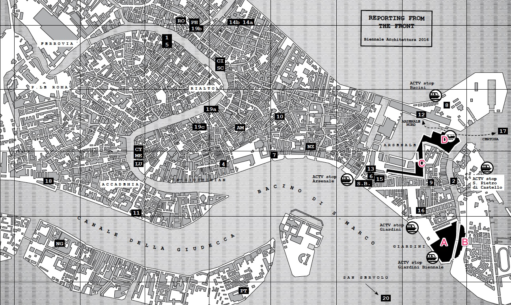

# 15届威尼斯建筑双年展ikuku报道

第15届威尼斯建筑双年展即将在五月下旬的旖旎水城隆重开幕。本届策展人、2016普利兹克奖得主亚历杭德罗·阿拉维纳（Alejandro Aravena）将本届建筑双年展主题定为“前线报道（Reporting from The front）”。来自世界各地的专家学者和设计师将云集威尼斯，展示他们的作品。
***

## 志愿者团队：

**负责及联络人：**徐璐 

**具体分区情况:**

* A区(GIARDINI P4-5)： 张丽娟

* C区(ARSENALE P6-7)： 孔令仪

* D区(ARSENALE P8)： 王茜、项国超、位苗苗

**现场报道：** 邢茜

**相关活动(EVENTS):**     
    

**前期工作:** 杨茹      

* 其中地图数字部分为相关活动发生地点。

[PDF文件](15mia.pdf)

## 志愿者工作内容：
1. 在网上搜集各种威尼斯建筑双年展相关信息、报道
2. 申请原文出处授权
3. 上传到ikuku

现场报道：拍摄现场照片，可以编辑成文章上传到ikuku

## 工作内容说明：
1. 申请授权过后长时间收不到回复时，在对方没有明确说明未经授权不能转载的情况下，可先转载上传，之后通知对方已经转载，如有异议请他及时联系我们。
2. 上传时一定注明出处、版权和原文链接。（这些都有相关的填写位置，具体参考ikuku上传指南）
3. 上传时添加“威尼斯双年展”标签。

## 时间：
* 2016年5月28日-2016年11月27日

## 说明：
* 每人每周至少上传一篇相关文章或其他形式的信息
* 根据每人上传情况，负责人将会定期进行人员筛选
* 如有特殊情况或者确实找不到相关信息可与负责人徐璐说明
* 活动结束后会根据每人工作成果推荐至“2016年度ikuku优秀志愿者评选”活动

***
**欢迎加入威尼斯建筑双年展志愿者团队：** [ikuku志愿者招募](http://www.ikuku.cn/activity/ikuku-cnzhiyuanzhezaixingdongeeee2016nianweinisijianzhushuangnianzhan)