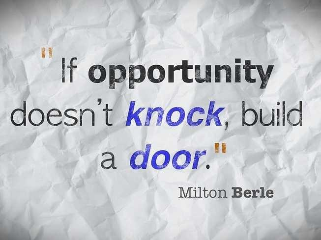

# 如何成为ikuku实习生或志愿者？  

### ikuku.cn|在库言库在做什么？

[ikuku.cn|在库言库](http://www.ikuku.cn)是中国第一个建筑设计行业的自媒体社区(UGC)及项目轻量级托管平台，聚集了百年全谱的全球华人优秀建筑设计师（包括90%以上大陆地区顶级建筑师），ikuku致力与解决线下建筑设计及室内装修市场交易及控制风险成本及高的问题,通过ikuku.cn的大数据及垂直优化算法，需求方可以找到高匹配度的建筑师、摄影师、专家学者等，从而降低交易时间成本，提高项目完成度。

目前ikuku上实名建筑师超过9,000人，用户超过50,000人，并以第三方担保的模式完成多个建筑及装修项目及承办过多场全国性、全球化的竞赛或评比。

你可以通过我们的网站[www.ikuku.cn](http://www.ikuku.cn)了解更多关于ikuku的信息。

### 关于ikuku的团队理念  

我们寻求有共同理念、热情和创造力的建筑相关实习生来到我们的团队，与ikuku共同发展。

ikuku坚守这样的价值观：我们相信开放是一种力量，象磁铁一样吸引着优秀的人才。 

### 关于月度实习生招募
* 工作内容：通过云办公与ikuku团队共同工作，挑战多个任务。
* 实习期：一个半月以上（可开实习证明），每周至少能办公3天及以上。
* 招募人数：每个阶段2人左右

### 附加荣誉

[ikuku优秀志愿者](volunteer-20.md)：驻场实习期两个月以上，表现优秀者除实习证明外，可以增加一封推荐信。

### 提供奖励

* 代表ikuku参加各种[媒体支持](http://www.ikuku.cn/tag/%E5%AA%92%E4%BD%93%E6%94%AF%E6%8C%81)活动
* 实物奖励（包括电子书、展览门票等）
* 留学经验介绍

### 实习内容: 

实习生可以擅长其中一项或多项任务。  
1. [社区活动策划与组织](volunteer-2.md) (包括：策划、组织、文案、平面设计)
1. 发现80、90后青年建筑师,并邀请入驻ikuku  
1. 专业内容    
 * [记者采访](http://www.ikuku.cn/tag/ikuku%E5%BF%97%E6%84%BF%E8%80%85%E9%87%87%E8%AE%BF)（采访对象：建筑师、厂家、业主...）  
 * 专业编辑  
   [百年华人建筑库](100.md)  
   [《甲方故事》](http://www.ikuku.cn/tag/%E7%94%B2%E6%96%B9%E6%95%85%E4%BA%8B)专栏内容编辑  
   [《DO IT YOURSELF》](http://www.ikuku.cn/tag/diy)专栏内容编辑  
   [建筑学习教程](http://www.ikuku.cn/tag/%E6%8A%80%E6%B3%95)干货分享文章编辑  
1. 网站开发
 * PHP代码开发  
 * 网站日常运维维护  

### 进行中的项目对实习生的要求: 

**实习项目: 30岁以下建筑师作品征集评选**
* 作品征集海报设计
* 评委招募海报设计
* 文案+海报上传（作品征集+评委招募）
* 将协办媒体推荐的作品，上传至ikuku
* 寻找媒体支持
* 评审结果上传  

**80X80建筑作品外延开发系列**
* [项目详情介绍](volunteer-21.md)
* 竞赛活动策划  
* 志愿者招募与运营  

### 成长历程   

* [历届最佳志愿者及评委会](volunteer-20.md)
* [实习感言及交流](volunteer-9.md)

### 联系方式  
[ikuku的联系方式](contact.md)  

### Q&A  

问：如何成为ikuku.cn|在库言库的志愿者或实习生？    
答: 有如下两种方式：1. 关注http://www.ikuku.cn/ucenter.php?action=activity 上相关信息。2. 发简历email到editor@ikuku.cn 并注明"ikuku实习" 。

问: 我已经成为ikuku志愿者很久了，怎么没有出现在ikuku.cn主页上？  http://www.ikuku.cn/names?t=ikuku-6  
答: 通过ikuku志愿者资格审核,并上传过作品或者协助ikuku志愿者项目上传作品(在参与人栏填写过你的名字)的志愿者,其名字会显示在[ikuku首页的人物栏](http://www.ikuku.cn/names?t=ikuku-6)。 

 
